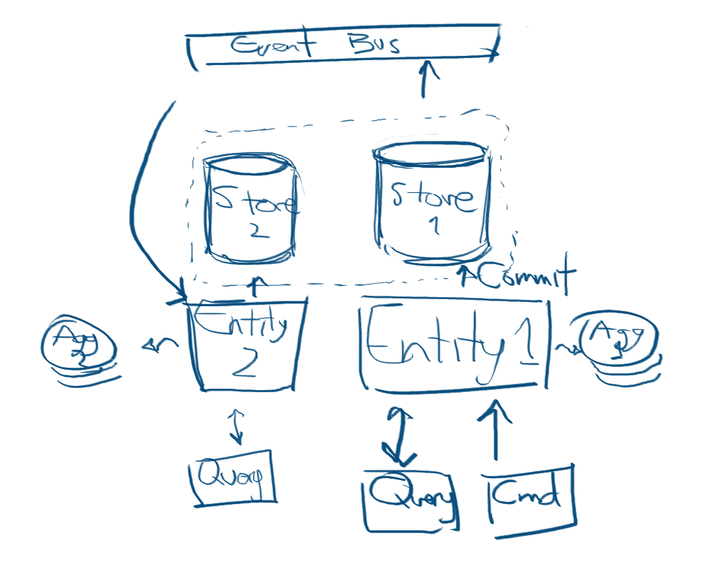

# RikerES

An event sourcing and CQRS astraction that aims to be practical more than "go by the book". It's built on top of [Riker](https://riker.rs/) a lightweight actor framework.  
**WARNING** It's pretty much alpha quality at the moment, features are still missing and the API is still changing. 



## How to use
This library adds a few extra event-sourcing related concepts to Riker, **entities** represent a domain and are the entry point where external commands and bussiness logic is handled. Created with the `Entity` actor using the usual Riker machinery(see [creating actors](https://riker.rs/actors/#creating-actors)).
```rust
let entity = actor_system.actor_of_args::<Entity<MyEntity>, _>("my-entity", SomeArgs)`;
```
### Defining your entity
`MyEntity` is a user supplied struct that implements the `ES` trait.
```rust
struct MyEntity;

#[async-trait]
impl ES for MyEntity {
  type Args = SomeArgs; // the arguments passed to the constructor
  type Model = MyData; // The "aggregate" is the data that is to be persisted along with its updates.
  type Cmd = MyEntityCommands; // The external command or commands(often in the form of an enum) this entity can handle.
  // type Event = (); // TODO: Similar to commands but for handling events emitted by other entities.
  type Error = MyEntityError; // Error produced by the handler functions.
  
  // Used to construct an entity, receives the `Entity` actor's context 
  // to be able to create other actors and hold their references
  fn new(_cx: &Context<CQRS<Self::Cmd>>, _args: Self::Args) -> Self {
    MyEntity
  }
  
  async fn handle_command(
    &mut self,
    cmd: Self::Cmd,
  ) -> Result<Commit<Self::Model>, Self::Error> {
    // do your command handling here and return a commit that will be persited
    // to the configured store(a simple memory store atm).
    
    // when entities are created for the first time
    Ok(Event::Create(MyData).into())
    // or to update an existing entity
    // Ok(Event::Change("some id".into(), MyDataUpdate).into())
  }
}
```

### Aggregates and rehidrating an entity's state
Define your aggregate(the data model), the updates it can handle and how to apply them. 

```rust
struct MyData {
  some_id: String,
  some_field: String,
  other_field: Option<String>
}

enum MyDataUpdate {
  TheChange(String, String),
  LittleChange(String),
}

impl Model for MyData {
  type Change = MyDataUpdate;
  
  fn id(&self) -> EntityId {
    self.some_id.into()
  }
  
  fn apply_change(&mut self, change: Self::Change) {
    match change {
      MyDataUpdate::TheChange(field, other) => {
        self.some_field = field;
        self.other_field = Some(other);
      },
      MyDataUpdate::LittleChange(field) => {
        self.some_field = field;
      },
    }
  }
}
```
Later the state of an entity can be queried with the entity actor.
```rust
let my_data: MyData = ask(&actor_system, &entity, Query::One("123".into())).await;
```
